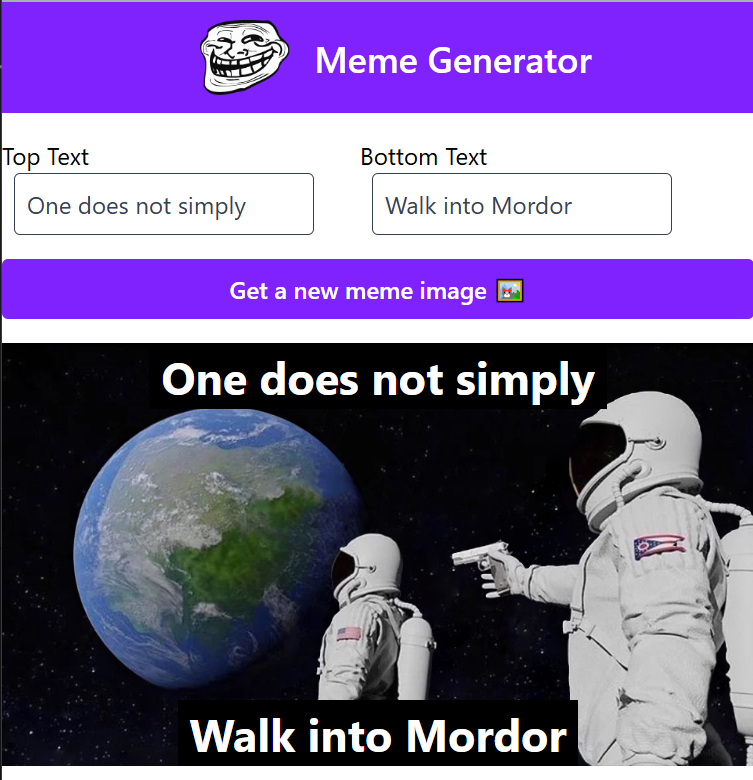

# Meme Generator

A fun and simple Meme Generator built using **React** and **TailwindCSS**. This app allows users to fetch meme images from the Imgflip API and add their own custom top and bottom text to generate hilarious memes instantly.

## Features

- Fetches memes from the [Imgflip Meme API](https://api.imgflip.com/get_memes)
- Displays a random meme each time you click the button
- Users can input custom top and bottom text
- Fully responsive and styled with TailwindCSS
- Clean functional component structure using React hooks (`useState`, `useEffect`)

## Preview



## 🛠️ Tech Stack

- **React**
- **TailwindCSS**
- **JavaScript (ES6+)**
- **Vite** (for lightning-fast dev environment)

## 🚀 Getting Started

To run this project locally:

```bash
# 1. Clone the repository
git clone https://github.com/Molo-M/meme-generator-project.git

# 2. Navigate into the project directory
cd meme-generator-project

# 3. Install dependencies
npm install

# 4. Start the development server
npm run dev
````

## 🧠 Folder Structure

```
src/
├── assets/              # Images (e.g. troll-face.png)
├── components/          # Header and main app components
│   ├── Header.jsx
│   └── MyMain.jsx
├── App.jsx              # Main App component
├── main.jsx             # React entry point
├── index.css            # Global styles including Tailwind
```

## 🌐 API Used

* [Imgflip Get Memes API](https://api.imgflip.com/get_memes)

## 📄 License

This project is open source and available under the [MIT License](LICENSE).

---

Made with ❤️ and 🤣 by \Molo Munyansanga


